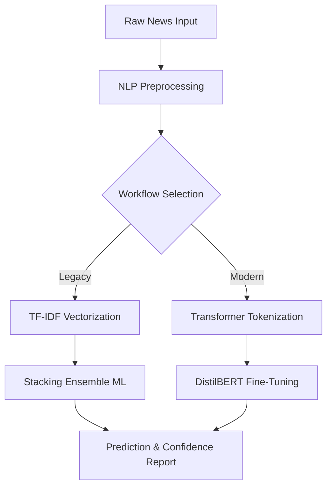

# PROJECT SYNOPSIS

## Fake News Detection Using Natural Language Processing and Deep Learning Transformers
---
### M.Sc. Data Science — Minor Project
---

| **Field**                | **Details**                                                                 |
|--------------------------|-----------------------------------------------------------------------------|
| **Project Title**        | Fake News Detection Using NLP, Machine Learning, and Transformers          |
| **Degree Program**       | M.Sc. Data Science                                                         |
| **Domain**               | Natural Language Processing, Deep Learning, AI Ethics                      |
| **Programming Language** | Python 3.10+                                                               |
| **Primary Frameworks**   | PyTorch, Hugging Face Transformers, Scikit-Learn                           |

---

## 1. Introduction
The digital information age has brought about a paradigm shift in how information is disseminated and consumed. However, this accessibility has a dark side: the rapid spread of misinformation, popularly known as "Fake News." Fake news is not merely an error in reporting; it is a deliberate attempt to deceive, often for political, financial, or social gain.

This project addresses the challenge of automated misinformation detection. By moving beyond traditional keyword-based filters and implementing state-of-the-art **Transformer-based models (DistilBERT)**, we aim to build a system that understands the **contextual nuance** of news articles rather than just the frequency of words.

---

## 2. Literature Review
To build a robust system, this project draws inspiration from several landmark studies in the field of NLP:

1. **TF-IDF and Classic Classifiers (2010-2015)**: Early work by Wang (2017) on the "Liar, Liar" dataset established that simple linguistic features, when combined with Support Vector Machines (SVM), could identify basic misinformation but struggled with satire and subtle propaganda.
2. **Word Embeddings (Word2Vec/GloVe)**: The shift toward dense vector representations allowed models to understand word similarities, but they still lacked contextual understanding (e.g., the word "bank" having different meanings).
3. **The Transformer Revolution (2017 - Present)**: Vaswani et al. (2017) introduced the "Attention" mechanism, which changed NLP forever. This project implements **DistilBERT**, a distilled version of the original BERT model, which retains 97% of the performance while being 40% smaller and 60% faster, making it ideal for real-time detection.

---

## 3. Problem Statement & Feasibility
### 3.1. Problem Statement
The volume of social media posts and news articles is too vast for human fact-checkers to manage. There is an urgent need for a system that can:
- Process thousands of articles per second.
- Identify the "sentiment of deception."
- Provide a confidence score to aid human moderators.

### 3.2. Feasibility Study
#### Technical Feasibility
Python’s ecosystem (PyTorch/Transformers) provides the necessary libraries to implement high-level AI without building architectures from scratch. The availability of pre-trained models allows for "Transfer Learning," significantly reducing training time.

#### Economic Feasibility
By using **DistilBERT**, we reduce the computational cost (GPU hours) compared to larger models like GPT-4 or BERT-Large, making the project viable on consumer-grade hardware.

#### Operational Feasibility
The system is designed with a simple inference API, meaning it can be integrated into browser extensions or social media backends with minimal friction.

---

## 4. System Objectives
The project is structured around five core objectives:
1. **Multi-Source Data Integration**: Merging global (WELFake) and regional (IFND) datasets to ensure the model isn't biased toward one specific geographic writing style.
2. **Contextual Feature Extraction**: Using Transformer tokenizers to understand sub-word patterns and sentence structure.
3. **Hybrid Modeling**: Maintaining a "Traditional ML" baseline to compare against the "Deep Learning" champion model.
4. **Probability Calibration**: Ensuring that a "90% confidence" score from the model actually correlates to a 90% accuracy rate in reality.
5. **Deployment Readiness**: Serializing the model and tokenizer for easy integration.

---

## 5. Detailed Methodology
The project follows a rigorous Data Science lifecycle:

### 5.1. Data Preparation & Cleaning
Unlike traditional ML, Deep Learning requires less manual "feature engineering" but more "data quality control." We implement:
- **Noise Reduction**: Removing HTML tags and non-ASCII characters.
- **Dynamic Padding**: Ensuring all text sequences are normalized for the neural network.

### 5.2. System Architecture

---

## 6. Software & Hardware Requirements
### 6.1. Software Requirements
- **Operating System**: Windows 10/11 or Linux (Ubuntu 20.04+).
- **IDE**: Jupyter Notebook / VS Code.
- **Libraries**: 
    - `transformers`: For model architecture.
    - `torch`: For the neural network engine.
    - `scikit-learn`: For traditional ML and metrics.

### 6.2. Hardware Requirements
- **RAM**: Minimum 8GB (16GB recommended).
- **GPU**: NVIDIA GPU with 4GB+ VRAM (Optional but highly recommended for training).
- **Storage**: 2GB for model weights and datasets.

---

## 7. Conclusion & Expected Results
We expect the **Transformer model** to outperform the **Stacking Classifier** by approximately 5-8% in accuracy, particularly on datasets involving complex political commentary. This project will conclude with a comprehensive report comparing the trade-offs between "Speed" (Traditional ML) and "Accuracy" (Deep Learning).

---
## 8. References
1. Vaswani, A., et al. (2017). "Attention Is All You Need."
2. Sanh, V., et al. (2019). "DistilBERT, a distilled version of BERT."
3. Wang, W. Y. (2017). "Liar, Liar Pants on Fire: A New Benchmark Dataset for Fake News Detection."
